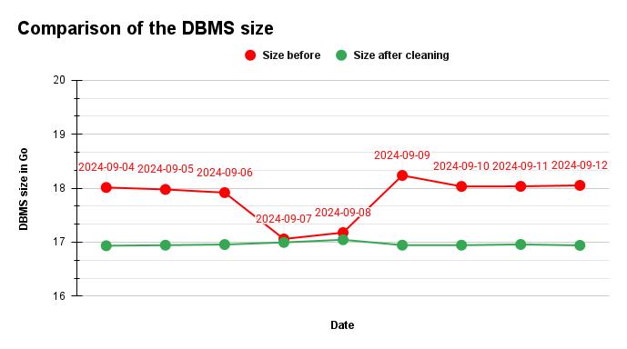

<div align="center">
    <h1>🗄️ DBMSCleaner</h1>
    <p><i>High-performance database optimization tool built with Rust</i></p>
</div>

<div align="center">


</div>

<div align="center">

**Supported Databases**


**Platform Support**


</div>

## 📖 Overview

**DBMS Cleaner** is a lightweight, efficient tool designed to optimize and clean your database. Built with Rust, it
ensures optimal performance by reducing storage usage and optimizing all tables (except system tables) without altering
configurations or requiring manual intervention.

Whether you're running a server or an application, DBMS Cleaner keeps your database in peak condition, compatible across
all major platforms.

---

## ✨ Key Features

- 🚀 **Efficient Storage Optimization:** Reduce database size by rebuilding indexes.
- ⚙️ **Table Optimization:** Ensures all tables (excluding system tables) are optimized.
- 🖥️ **Cross-Platform Support:** Seamlessly run on Windows, MacOS, and Linux.
- 🛠️ **Simple Integration:** No changes to FILE configurations required.
- 🛡️ **Safe and Reliable:** Maintains database integrity without the need for backups.
- 🔧 **Customizable:** Easily configure settings via `config.json`.
- ⏱️ **Fast Execution:** Run it as a cron job or scheduled task for continuous optimization.

---

## 📋 Prerequisites

- **Rust Compiler** (Install via [Rustup](https://rustup.rs/))
- **Cargo Package Manager** (Installed with Rust)
- Supported database drivers: `mysql`, `mariadb`, or `postgres`

---

## 🔧 Installation

Follow these steps to get started:

### 1. Clone the Repository

```bash
git clone https://github.com/Maxime-Cllt/DBMSCleaner.git
cd DBMSCleaner
```

### 2. Compile the Program

```bash
cargo build --release
```

### 3. Configure the Connection

Create a file named `cleaner.json` in the same directory as the compiled program. DBMSCleaner supports multiple
databases in a single configuration file:

**Multi-Database Configuration (Recommended):**

```json
{
  "databases": [
    {
      "name": "Production PostgreSQL",
      "driver": "postgres",
      "host": "localhost",
      "port": "5432",
      "username": "postgres",
      "password_env": "POSTGRES_PASSWORD",
      "schema": "public"
    },
    {
      "name": "Analytics MySQL",
      "driver": "mysql",
      "host": "localhost",
      "port": "3306",
      "username": "root",
      "password_env": "MYSQL_PASSWORD",
      "schema": "analytics"
    }
  ],
  "dry_run": false,
  "require_confirmation": true
}
```

**Security Features:**

- 🔐 Use `password_env` to reference environment variables instead of hardcoding passwords
- ⚠️ `require_confirmation` asks for approval before running (set to `false` for automation)
- 🔍 `dry_run` mode previews operations without executing them

**Multiple Schemas:**
You can include multiple schemas separated by commas or use `*` to clean all schemas (except system schemas):

```json
"schema": "test1,test2,test3"
```

For detailed configuration options, see [README_CONFIG.md](README_CONFIG.md)

### 4. Run the Program

**Set environment variables (if using `password_env`):**

```bash
# Linux/macOS
export POSTGRES_PASSWORD="your_secure_password"
export MYSQL_PASSWORD="your_mysql_password"

# Windows (PowerShell)
$env:POSTGRES_PASSWORD="your_secure_password"
$env:MYSQL_PASSWORD="your_mysql_password"
```

**Execute the cleaner:**

#### For MacOS & Linux:

```bash
./target/release/DBMSCleaner
```

#### For Windows:

```bash
.\target\release\DBMSCleaner.exe
```

---

## 🧪 Code Quality

### Unit Tests available

To ensure the reliability of the DBMS Cleaner, unit tests are included. You can run the tests using Cargo:

```bash
cargo test
```

## 📝 Notes

- **Exclusions:** Does not clean triggers, stored procedures, functions, or views.
- **Privileges Required:** Ensure the program has sufficient privileges to connect and clean the database.
- **Frequency:** Safe to run frequently for continuous optimization.

---

## 📊 Performance and Results

I use this program to clean my database every night. Here is a graph that show the size of my database before and after
the cleaning process.

### Size benefit

<div align="center">
    
</div>

## 🔗 See Also

- [SQLiteCleaner](https://github.com/Maxime-Cllt/SqliteCleaner)
- [Rust Language](https://www.rust-lang.org/)

---

### 📜 License

This project is licensed under the [MIT License](https://opensource.org/licenses/MIT).

## 🤝 Contributing

Contributions are welcome! To contribute:

- **Fork the Repository**
- **Create a Feature Branch**:
  ```bash
  git checkout -b feature/your-feature-name
    ```